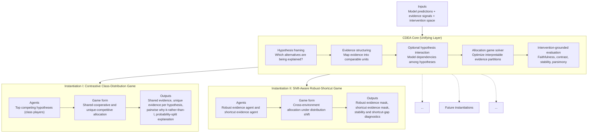
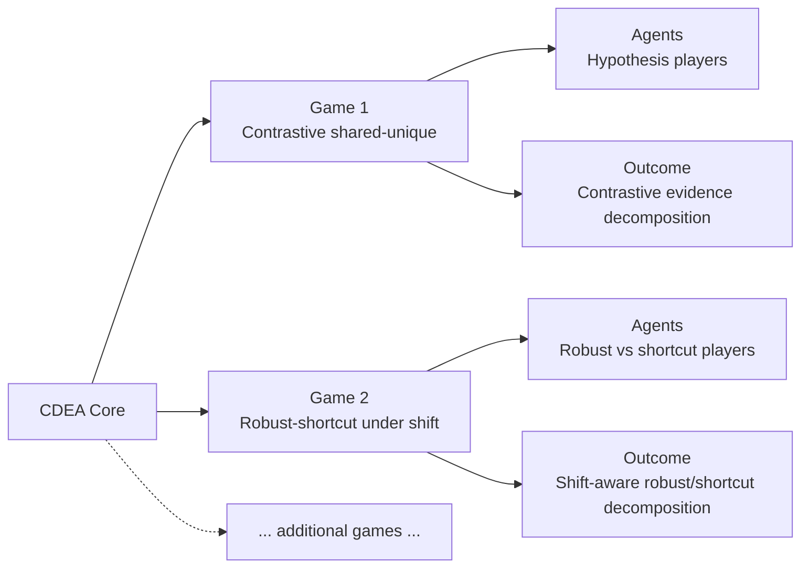

# CDEA Framework Block Diagrams (Abstract)

This version is intentionally conceptual and paper-facing. It avoids implementation or code references.

## 1) Unified CDEA Framework (Abstract View)

## 2) Instantiation Semantics (Agent-Game-Output)

## 3) Caption Starter (Abstract)

CDEA is a unifying explanation framework that turns raw class-conditioned evidence into game-theoretic evidence allocations. A shared core defines hypothesis framing, evidence structuring, optional interaction, allocation optimization, and intervention-grounded evaluation; distinct instantiations define agent sets and game objectives while producing structured, interpretable outputs.
